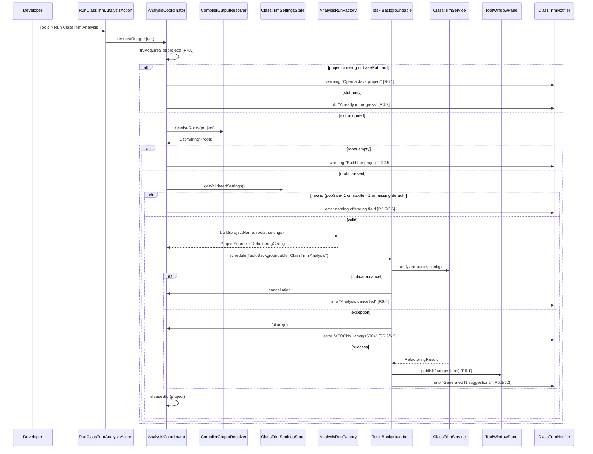
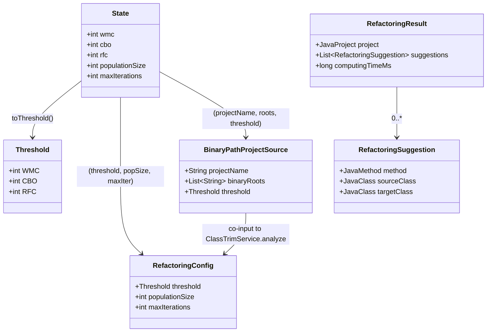

# Design Document

## Overview

The `idea-plugin` feature delivers an IntelliJ IDEA plugin (`classtrim-plugin` Maven module) that lets a developer trigger the existing `org.classtrim.core.service.ClassTrimService` against the project currently open in the IDE and surfaces the resulting move-method suggestions through a tool window and balloon notifications.

The plugin is intentionally a thin shell over `classtrim-core`. It does not change any analysis logic; it adds:

- A **Tools menu action** (`Run ClassTrim Analysis`) that starts at most one Analysis_Run per IDE_Project.
- A **CompilerOutputResolver** that builds the `Compiler_Output_Roots` list from IntelliJ's compiler-extension data (project- and module-level), deduplicates paths, drops entries that do not exist on disk, and falls back to `<project_base_path>/target/classes` only when neither IntelliJ extension provides any output.
- A **per-project settings service** (`ClassTrimSettingsState`) that persists thresholds, population size, and maximum iteration count, and a **Settings page** to edit them.
- A **background Task.Backgroundable** scheduled through `ProgressManager` so analysis runs off the EDT, with a cancellable status-bar progress indicator titled `"ClassTrim Analysis"`.
- A **ClassTrim tool window** that publishes the `List<RefactoringSuggestion>` produced by a successful Analysis_Run, replacing any prior list for that project.
- A **notification group** (`ClassTrim Notifications`) used for all start/complete/cancel/failure messages.

Out of scope (and explicitly excluded by the requirements): result-table sorting/navigation, applying suggestions through `RefactoringFactory`, batch apply, baseline comparison, and export.

### Key Design Decisions

- **Reuse, do not re-implement, the core API.** The plugin instantiates `StandardProjectAnalyzer + InMemoryProjectRepository + NSGAIIIRefactoringEngine + ClassTrimService` per Analysis_Run. The repository is short-lived (per run) so that re-running analysis after a rebuild does not return cached stale results.
- **Pure resolver and pure config-builder.** Compiler-root resolution and settings-to-config translation are pure functions over plain inputs (lists of strings, primitive ints), which makes them straightforward to property-test without spinning up an IntelliJ test fixture.
- **Single `AnalysisCoordinator` per project**, owning the `AtomicReference<ProgressIndicator>` for the in-flight run. This is the single source of truth for "is an Analysis_Run currently executing for this project?", which in turn drives action enable/disable (R1.3) and the duplicate-trigger rejection (R4.5, R4.7).
- **All notifications go through the `ClassTrim Notifications` group.** This satisfies R6.1, R6.3, R6.4 and gives the developer a single, filterable channel.

### Mapping Summary (Requirement → Component)

| Requirement | Primary Components |
|---|---|
| R1 — Invoke from IDE | `RunClassTrimAnalysisAction`, `AnalysisCoordinator` |
| R2 — Resolve compiled class roots | `CompilerOutputResolver` |
| R3 — Read analysis parameters | `ClassTrimSettingsState`, `AnalysisRunFactory` |
| R4 — Off-EDT execution | `AnalysisCoordinator`, IntelliJ `ProgressManager.Task.Backgroundable` |
| R5 — Surface results | `ClassTrimToolWindowPanel`, `ClassTrimNotifier` |
| R6 — Failure handling | `AnalysisCoordinator`, `ClassTrimNotifier`, plugin `Logger` |

## Architecture

### High-Level Flow



### Module / Package Layout

```
classtrim-plugin/
  src/main/java/org/classtrim/plugin/
    RunClassTrimAnalysisAction.java        // Tools-menu action, update() + actionPerformed()
    AnalysisCoordinator.java               // @Service(Project) — slot management, orchestration
    AnalysisRunFactory.java                // Pure: settings + roots -> ProjectSource + RefactoringConfig
    CompilerOutputResolver.java            // Pure-ish: project/modules + FS check -> deduped roots
    ClassTrimNotifier.java                 // Wraps NotificationGroupManager calls
    ClassTrimToolWindowFactory.java        // Registers tool window
    ClassTrimToolWindowPanel.java          // Hosts suggestions table; updateSuggestions(...)
    settings/
      ClassTrimSettingsState.java          // @Service(Project) PersistentStateComponent
      ClassTrimSettingsConfigurable.java   // Settings UI page
  src/main/resources/META-INF/
    plugin.xml                             // Action, tool window, settings, notification group
```

### Threading Model

- **EDT only:** `AnAction.update()`, action enablement, settings UI, tool-window panel mutations (wrapped through `SwingUtilities.invokeLater` from background callbacks).
- **Background (pooled):** the entire body of `Task.Backgroundable.run(ProgressIndicator)` — root resolution, settings read (read action), service construction, `ClassTrimService.analyze(...)`.
- **Cancellation propagation:** the `ProgressIndicator`'s built-in cancel button is the single cancel source. The coordinator polls `indicator.checkCanceled()` between phases (after roots, after settings, after analyze) so a cancel is observed within ≤1 s. Because `ClassTrimService.analyze` is synchronous and not currently cancel-aware, an in-flight algorithm run will finish its current iteration before cancellation is honored; the coordinator then discards the partial result instead of publishing it (R4.4, R6.4).

### Concurrency / Run-Slot Management

`AnalysisCoordinator` keeps an `AtomicReference<ProgressIndicator> runningIndicator`:

- `requestRun()` first calls `compareAndSet(null, placeholder)`. On `false`, it surfaces the "already in progress" notification (R4.7) and returns. On `true`, it reserves the slot and proceeds.
- `Task.Backgroundable.onFinished()` (called for completion, failure, and cancellation) replaces the running indicator with `null`, removing the status-bar progress within IntelliJ's normal teardown window (R4.6).
- `RunClassTrimAnalysisAction.update()` reads the same atomic reference and disables itself when it is non-null or when `event.getProject()` is null (R1.2, R1.3).

### Plugin Extensions Registered (`plugin.xml`)

| Extension | Purpose | Requirement |
|---|---|---|
| `<action>` `ClassTrim.RunAnalysis` in `ToolsMenu` | Invocation entry point | R1.1, R1.2, R1.3 |
| `<toolWindow id="ClassTrim">` | Suggestion publication target | R5.1, R5.5 |
| `<projectService>` `ClassTrimSettingsState` | Persisted configuration | R3.1, R3.4 |
| `<projectService>` `AnalysisCoordinator` | Slot management | R4.5, R4.7 |
| `<projectConfigurable>` `ClassTrimSettingsConfigurable` | Settings UI | R3 (editing) |
| `<notificationGroup id="ClassTrim Notifications">` | Centralized messaging | R6.1, R6.3, R6.4 |

## Components and Interfaces

### `RunClassTrimAnalysisAction extends AnAction`

Responsibilities:

- `update(AnActionEvent e)` — sets `e.getPresentation().setEnabled(...)` to `false` when `e.getProject() == null` **or** `AnalysisCoordinator.getInstance(project).isRunning()` (R1.2, R1.3). Runs on the BGT update thread (`getActionUpdateThread() == BGT`).
- `actionPerformed(AnActionEvent e)` — delegates to `AnalysisCoordinator.getInstance(project).requestRun()`. Returns immediately so that the indicator becomes visible within 2 s (R1.1).

Failure path: if `project == null` or `project.getBasePath() == null`, the coordinator emits the warning notification through the `ClassTrim Notifications` group within 1 s and returns (R6.1).

### `AnalysisCoordinator` (`@Service(Project)`)

```java
public final class AnalysisCoordinator {
    public boolean isRunning();
    public void    requestRun();        // entry point from the action
    public void    cancelRunning();     // bound to the indicator
}
```

- Owns `AtomicReference<ProgressIndicator> runningIndicator` and (for tests) a swappable `BackgroundTaskScheduler`.
- Composes `CompilerOutputResolver`, `ClassTrimSettingsState`, `AnalysisRunFactory`, `ClassTrimNotifier`, `ClassTrimToolWindowPanel`.
- Verifies preconditions in this order so that error messages are deterministic:
  1. Project + base path present (R6.1).
  2. Slot free (R4.5, R4.7).
  3. `roots = resolver.resolve(project)`; if empty → cancel before constructing `ProjectSource`, warn "Build the project first" (R2.5, R3.7).
  4. `validatedSettings = settings.validate()`; on `MIN_VALUE_VIOLATION` or `MISSING_DEFAULT` → cancel before constructing `RefactoringConfig`, error notification naming the field; persisted settings are untouched (R3.5, R3.6).
  5. Build `Task.Backgroundable("ClassTrim Analysis", cancellable=true)` and submit through `ProgressManager`.
- In `run(indicator)`: calls `service.analyze(source, config)` inside a `try/catch (ProcessCanceledException | RuntimeException)`. Catches differ:
  - `ProcessCanceledException` → cancellation path (R4.4, R6.4).
  - any other `Throwable` → failure path: log full stack trace via `Logger.getInstance(AnalysisCoordinator.class).error(t)` (R6.2), notify with `t.getClass().getName() + ": " + truncate(t.getMessage(), 500)` (R6.3), do not publish suggestions (R5.5).
- In `onFinished()`: clears `runningIndicator` and refreshes the action's enabled state.

### `CompilerOutputResolver`

Pure-ish helper extracted into its own class for testability. Signature:

```java
public final class CompilerOutputResolver {
    public List<String> resolve(Project project);

    // Test seam: pure function over already-extracted strings + an FS predicate
    static List<String> resolveFromInputs(
            String projectOutputUrlOrNull,                  // CompilerProjectExtension URL (may be null)
            List<String> moduleOutputPathsRawNullable,      // each may be null/blank
            String projectBasePathOrNull,                   // for fallback
            Predicate<String> existsOnDisk);                // FS injection
}
```

Algorithm (pure layer):

1. `result := new LinkedHashSet<String>()` (preserves insertion order, deduplicates).
2. If `projectOutputUrlOrNull != null && !blank`, resolve to FS path via `VfsUtilCore.urlToPath` and add when non-blank.
3. For each module path in order, **skip** when `null` or blank (no error to developer — R2.2). Otherwise add.
4. After (2)+(3), drop any entry where `existsOnDisk.test(path) == false` (R2.4).
5. **Fallback (R2.3) — applies only when neither the project URL nor any module path was provided** (i.e., before step 4, the working set was empty). In that case, if `projectBasePathOrNull != null`, try `<basePath>/target/classes`; add it only if it exists.
6. Return `List.copyOf(result)` preserving discovery order.

The IntelliJ-facing layer (`resolve(Project)`) just calls `CompilerProjectExtension.getInstance(project)` and `ModuleManager.getInstance(project).getModules()`, extracts the strings, and forwards them with `Files::exists` as the predicate.

> Note: the requirement uses "no project-level output URL **and** no module-level paths" to gate the fallback. We interpret "no module-level paths" as "every module returned `null` or blank", not "modules collection is empty". This is consistent with R2.2 which already discards null/blank module entries.

### `AnalysisRunFactory`

Pure builder. Signature:

```java
public final class AnalysisRunFactory {
    public static ProjectSource     buildSource(String projectName, List<String> roots, Threshold t);
    public static RefactoringConfig buildConfig(Threshold t, int populationSize, int maxIterations);
    public static Result<RunInputs, ValidationError> validate(SettingsView v, List<String> roots, String projectName);
}
```

- `buildSource` returns `new BinaryPathProjectSource(projectName, roots, t)` with **no transformation** of any field (R3.3).
- `buildConfig` returns `new RefactoringConfig(t, populationSize, maxIterations)` with **no transformation** (R3.2).
- `validate` enforces R3.5 (`populationSize >= 1`, `maxIterations >= 1`), R3.6 (each settings field has a value, defaulted or developer-assigned), and R3.7 (`!roots.isEmpty()`); on success it returns the `RunInputs` (the `ProjectSource` and `RefactoringConfig` it would build), on failure it returns a typed `ValidationError` carrying the offending field name. The coordinator turns this into a notification.

### `ClassTrimSettingsState` (`@Service(Project)` `PersistentStateComponent<State>`)

Already partially implemented. Confirmed shape:

```java
public static final class State {
    public int wmc = 8;
    public int cbo = 8;
    public int rfc = 30;
    public int populationSize = 500;
    public int maxIterations = 2000;
}
```

For this feature it gains a `SettingsView view()` method that returns an immutable view (`int wmc, cbo, rfc, populationSize, maxIterations`) plus a `Defaults defaults()` static accessor used by `validate` to satisfy R3.4 / R3.6. `updateFrom(...)` remains unchanged — `validate` never mutates the persisted state (R3.5, R3.6).

### `ClassTrimSettingsConfigurable`

Existing implementation is sufficient: spinners with `min=1` for population/iterations enforce R3.5 at the UI level, but the runtime `validate()` keeps the contract enforceable for any code path (e.g., manual XML edits to `classtrim.xml`).

### `ClassTrimToolWindowPanel`

- Holds a `DefaultTableModel` with columns `Method`, `From`, `To`.
- Exposes `static updateSuggestions(Project, List<RefactoringSuggestion>)` (already implemented). On invocation it clears existing rows and inserts one row per suggestion on the EDT.
- Failure / cancellation paths never call `updateSuggestions`, satisfying R5.5.
- The static `PANELS` map is keyed by `project.getLocationHash()` (already in place).

### `ClassTrimNotifier`

Thin wrapper that always uses `NotificationGroupManager.getInstance().getNotificationGroup("ClassTrim Notifications")` and exposes:

```java
void info(Project p, String title, String body);
void warning(Project p, String title, String body);
void error(Project p, String title, String body);
String truncate(String s, int max);   // null-safe; returns "" when null
```

`truncate` enforces the 500-character cap (R6.3) by returning `s` unchanged when `s.length() <= max`, otherwise `s.substring(0, max)`. `null` collapses to the empty string.

## Data Models

The plugin operates on existing `classtrim-core` types only; it does not introduce any persisted domain model beyond `ClassTrimSettingsState.State`.



### Field Mapping (`Plugin_Settings` → `ProjectSource` / `RefactoringConfig`)

| Source (Plugin_Settings) | Target | Transformation |
|---|---|---|
| `state.wmc, state.cbo, state.rfc` | `Threshold(WMC, CBO, RFC)` | Identity (constructor argument order matches) |
| `Threshold` (above) | `RefactoringConfig.threshold` | Identity (R3.2) |
| `state.populationSize` | `RefactoringConfig.populationSize` | Identity (R3.2) |
| `state.maxIterations` | `RefactoringConfig.maxIterations` | Identity (R3.2) |
| `Project.getName()` | `BinaryPathProjectSource.projectName` | Identity (R3.3) |
| `Compiler_Output_Roots` | `BinaryPathProjectSource.binaryRoots` | Identity (R3.3); `BinaryPathProjectSource` defensively copies via `List.copyOf` |
| `Threshold` (above) | `BinaryPathProjectSource.threshold` | Identity (R3.3) |

### Auxiliary Types

```java
record SettingsView(int wmc, int cbo, int rfc, int populationSize, int maxIterations) {}

sealed interface ValidationError {
    record MinValueViolation(String fieldName, int actual) implements ValidationError {}
    record MissingDefault   (String fieldName)             implements ValidationError {}
    record NoCompilerRoots  ()                             implements ValidationError {}
}

record RunInputs(ProjectSource source, RefactoringConfig config) {}
```

These three records exist only inside the plugin module and are never persisted; they exist purely to make `AnalysisRunFactory.validate(...)` a pure, easily testable function.

## Correctness Properties

*A property is a characteristic or behavior that should hold true across all valid executions of a system — essentially, a formal statement about what the system should do. Properties serve as the bridge between human-readable specifications and machine-verifiable correctness guarantees.*

The plugin contains both pure logic (root resolution, settings → config mapping, validation, notification formatting) and pure state machines (the run-slot, the publication state). These are the surfaces where property-based testing pays off: each pure layer is exercised through its own test seam, with no IntelliJ test fixture required for the property tests themselves. Heavy IntelliJ integration glue (action update, ProgressManager wiring, status-bar timing) is covered by example/integration tests in the Testing Strategy.

The seven properties below are the result of consolidating overlapping criteria from the prework — each one validates a distinct concern.

### Property 1: Compiler-output resolution is idempotent, total, and dedupes existing paths

*For any* tuple `(projectOutputUrl, moduleOutputPaths[], projectBasePath, existsOnDisk: Predicate<String>)`, where `moduleOutputPaths` may contain `null` or blank entries, `CompilerOutputResolver.resolveFromInputs(...)` returns a list `R` such that:

1. every element of `R` satisfies `existsOnDisk`;
2. every element of `R` is non-`null` and non-blank;
3. `R` contains no duplicates;
4. `R` preserves first-seen order across the input sequence (project URL first, then modules in iteration order, then optional fallback);
5. when at least one of `projectOutputUrl` or `moduleOutputPaths` provides a non-null/non-blank value, the fallback `<basePath>/target/classes` is **not** added even if it would exist;
6. when neither `projectOutputUrl` nor any `moduleOutputPaths` entry provides a non-null/non-blank value and `projectBasePath` is non-null, the fallback `<basePath>/target/classes` appears in `R` iff `existsOnDisk` accepts it;
7. the resolver never throws.

**Validates: Requirements 2.1, 2.2, 2.3, 2.4**

### Property 2: Settings-to-Config / Settings-to-Source mapping is identity, with defaults filling unset fields

*For any* `(projectName: String, roots: List<String>, settingsView: SettingsView)` where `roots` is non-empty, `populationSize >= 1`, and `maxIterations >= 1`:

- `AnalysisRunFactory.buildConfig(threshold(settingsView), settingsView.populationSize, settingsView.maxIterations)` produces a `RefactoringConfig` whose `getThreshold()`, `getPopulationSize()`, and `getMaxIterations()` are bit-equal to the corresponding inputs;
- `AnalysisRunFactory.buildSource(projectName, roots, threshold(settingsView))` produces a `BinaryPathProjectSource` whose `getProjectName()` equals `projectName`, whose `getBinaryRoots()` equals `roots` element-wise, and whose `getThreshold()` equals the input threshold;
- and *for any* `SettingsView` constructed by overriding an arbitrary subset of fields starting from `Defaults` and leaving the remainder at their declared defaults, every field of the resulting `RefactoringConfig` and `BinaryPathProjectSource` reflects either the override (if present) or the declared default (otherwise).

**Validates: Requirements 3.2, 3.3, 3.4**

### Property 3: Validation rejects bad inputs without mutating persisted settings

*For any* `(SettingsView v, List<String> roots)` with `populationSize < 1` OR `maxIterations < 1` OR `roots.isEmpty()`:

- `AnalysisRunFactory.validate(v, roots, projectName)` returns a `ValidationError`;
- when `populationSize < 1`, the error is `MinValueViolation` with `fieldName == "populationSize"`;
- when `maxIterations < 1`, the error is `MinValueViolation` with `fieldName == "maxIterations"`;
- when `roots.isEmpty()`, the error is `NoCompilerRoots`;
- precedence is deterministic when multiple violations apply (resolved in the order: `NoCompilerRoots` < `MinValueViolation`, with population checked before iterations);
- the persisted `ClassTrimSettingsState.State` is bit-identical before and after the call;
- no `ProjectSource` and no `RefactoringConfig` is constructed when the result is a `ValidationError`.

**Validates: Requirements 3.5, 3.7**

### Property 4: At most one Analysis_Run executes concurrently per project

*For any* finite interleaving of `AnalysisCoordinator.requestRun()` invocations and task-completion callbacks for a single project, the count of "currently held" run slots over every prefix of the interleaving is in `{0, 1}`. Equivalently, on every concurrent batch of `requestRun()` calls only the first one acquires the slot and triggers a task submission; every subsequent call until the slot is released receives the rejection branch (no task submitted) and produces an "already in progress" notification, while the in-flight task is unaffected.

**Validates: Requirements 4.5, 4.7**

### Property 5: Tool-window publication state machine

The published `List<RefactoringSuggestion>` for a project is the model state. *For any* finite sequence of run terminations `T_1 ... T_n`, where each `T_i` is one of `Success(L_i)`, `Failure`, or `Cancellation`, the published list after applying `T_1 ... T_n` equals:

- `L_k`, the list from the most recent `Success(L_k)` in the sequence, if any such termination exists; otherwise
- the initial empty list.

In particular: `Failure` and `Cancellation` never modify the published list (no clearing, no partial publish), and `Success(L)` replaces the entire prior list with `L`.

**Validates: Requirements 4.4, 5.1, 5.5**

### Property 6: Success notification body reports the suggestion count

*For any* `K` with `K >= 0`, when the coordinator emits the success notification for a run that produced exactly `K` suggestions, the notification's severity is `INFORMATION`, the notification group id is `"ClassTrim Notifications"`, and the body contains the decimal representation of `K` such that parsing the count out of the body returns `K`. When `K == 0`, the body additionally contains a phrase indicating that no suggestions were produced.

**Validates: Requirements 5.2, 5.3**

### Property 7: Failure notification body is well-formed and bounded

*For any* `Throwable` with `className: String` (a non-blank fully qualified class name) and `message: String?` (possibly `null`, possibly arbitrarily long, possibly containing newlines / non-ASCII characters), the failure notification body produced by `ClassTrimNotifier.formatFailureBody(className, message)` satisfies:

- starts with `className`;
- contains the message portion (or the empty string when `message == null`) immediately after `className`;
- the message portion has `length <= 500`;
- when `message != null && message.length() <= 500`, the message portion equals `message`;
- when `message != null && message.length() > 500`, the message portion equals `message.substring(0, 500)`;
- the function never throws.

**Validates: Requirements 6.3**

## Error Handling

The plugin distinguishes three failure axes — preconditions, runtime exceptions, and cancellation — and routes each through a dedicated path so that the user sees a single, deterministic notification per failure.

### Precondition Failures (handled before any background work)

| Condition | Source | User-facing outcome | Backing requirement |
|---|---|---|---|
| `Project` is null or `getBasePath()` is null | `RunClassTrimAnalysisAction` / `AnalysisCoordinator` | Warning notification through `ClassTrim Notifications`, "Open a Java project". No task scheduled, no slot acquired. | R6.1 |
| Slot busy | `AnalysisCoordinator.requestRun` | Info notification "ClassTrim analysis is already in progress". In-flight task untouched. | R4.7 |
| `roots.isEmpty()` after resolution | `AnalysisCoordinator` checks `validate(...)` | Warning "Build the project before running ClassTrim". `ClassTrimService.analyze` not called. Slot released. | R2.5, R3.7 |
| `populationSize < 1` or `maxIterations < 1` | `AnalysisRunFactory.validate` | Error notification naming the offending field; persisted settings unchanged; no `RefactoringConfig` constructed. | R3.5 |
| Missing default for an unset field | `AnalysisRunFactory.validate` | Error notification naming the missing setting; persisted settings unchanged; no `RefactoringConfig` constructed. | R3.6 |

### Runtime Exception During `ClassTrimService.analyze`

Inside the `Task.Backgroundable.run(...)` body the coordinator wraps the analyze call in `try/catch`:

```java
try {
    indicator.checkCanceled();
    RefactoringResult result = service.analyze(source, config);
    indicator.checkCanceled();
    // success path
} catch (ProcessCanceledException pce) {
    cancellation();           // R6.4
    throw pce;                // let IntelliJ finish the task as cancelled
} catch (Throwable t) {
    failure(t);               // R6.2 + R6.3
}
```

`failure(t)`:
1. logs `t` (with stack trace) via `Logger.getInstance(AnalysisCoordinator.class).error(t)` (R6.2);
2. emits an error notification through `ClassTrim Notifications` whose body is `formatFailureBody(t.getClass().getName(), t.getMessage())` (R6.3, Property 7);
3. does **not** call `ClassTrimToolWindowPanel.updateSuggestions(...)` — Property 5 keeps the prior list intact (R5.5);
4. is followed by `Task.onFinished()` which clears the indicator and releases the slot (R4.6).

### Cancellation

`indicator.checkCanceled()` is invoked before and after `service.analyze`, and immediately after each phase boundary in the coordinator (post root resolution, post settings validation). On `ProcessCanceledException`:

1. The coordinator emits an info notification "ClassTrim analysis was cancelled" through `ClassTrim Notifications` (R6.4).
2. No suggestions are published — Property 5 ensures the prior list is preserved (R4.4, R5.5).
3. `Task.onFinished()` releases the slot and removes the status-bar indicator (R4.6).

### Resource Management

Each Analysis_Run uses a fresh `InMemoryProjectRepository` and `ClassTrimService`; both are local to `Task.Backgroundable.run(...)` and are eligible for garbage collection as soon as the task body returns. There are no long-lived open handles or threads owned by the plugin.

## Testing Strategy

### PBT Applicability Assessment

This feature mixes IDE plumbing (best tested by example) with pure logic (a great fit for property-based testing). After the prework reflection, the property-testable surfaces are:

- the **CompilerOutputResolver** (pure list transformation with an injected FS predicate);
- the **AnalysisRunFactory** (pure config / source / validation mapping);
- the **AnalysisCoordinator slot state machine** (pure boolean state machine, model-checked over random schedules);
- the **publication state machine** of `ClassTrimToolWindowPanel` (pure list-replacement model);
- two **formatting helpers** in `ClassTrimNotifier` (pure string functions).

The pieces that are **not** suitable for PBT — and that we therefore cover with example / integration tests instead — are:

- IntelliJ extension wiring (`plugin.xml`, action availability, tool-window registration);
- `Task.Backgroundable` scheduling timing and cancellation propagation;
- log-output side effects;
- end-to-end runs against a real fixture project.

### Test Layers

| Layer | Tooling | Scope |
|---|---|---|
| Pure unit / property tests | JUnit 5 + jqwik (property-based testing for Java) | `CompilerOutputResolver.resolveFromInputs`, `AnalysisRunFactory.{buildConfig, buildSource, validate}`, slot state machine, publication state machine, `ClassTrimNotifier.formatFailureBody` and the success-body formatter. No IntelliJ runtime. |
| IntelliJ light tests | `BasePlatformTestCase` / `LightJavaCodeInsightFixtureTestCase` | Action `update()` enable/disable wiring (R1.2, R1.3), notification group registration, settings persistence round-trip, tool-window content registration. |
| Integration tests | `HeavyPlatformTestCase` with a synthetic compiled project | End-to-end Analysis_Run against a real on-disk fixture; verifies progress indicator title, off-EDT execution, suggestions arrive in the tool window, cancellation aborts within 1 s. |

### PBT Configuration

- **Library:** [jqwik](https://jqwik.net/) — chosen because the plugin and core are JVM/Java, jqwik integrates natively with JUnit 5, and it shrinks counterexamples automatically. We will not implement a property framework from scratch.
- **Iteration count:** every `@Property` is configured with `@Property(tries = 100)` at minimum.
- **Tag format:** every property test method carries a Javadoc / `@Tag` line in the form `Feature: idea-plugin, Property {N}: {property text}` so the design property is traceable from the test.
- **One property test per design property:** each of Properties 1–7 is implemented by exactly one `@Property` method.

Example shape (illustrative only — not the actual implementation):

```java
/** Feature: idea-plugin, Property 1: Compiler-output resolution is idempotent, total, and dedupes existing paths */
@Property(tries = 100)
@Tag("classtrim-plugin")
void resolverPreservesInvariants(@ForAll("resolverInputs") ResolverInputs in) {
    List<String> result = CompilerOutputResolver.resolveFromInputs(
            in.projectUrl(), in.moduleOutputs(), in.basePath(), in.fakeFs());
    // (1) every entry exists on disk
    Assertions.assertThat(result).allMatch(in.fakeFs());
    // (2) no nulls / blanks
    Assertions.assertThat(result).noneMatch(s -> s == null || s.isBlank());
    // (3) deduped, (4) order preserved, (5)/(6) fallback rules
    Assertions.assertThat(result).isEqualTo(new ResolverModel(in).expected());
    // (7) total
}
```

### Example / Integration Tests

The following criteria are intentionally covered by example tests because their behavior does not vary meaningfully with input:

- R1.1 (action schedules exactly one task and shows progress);
- R1.2 / R1.3 (action enable/disable wiring — two examples each);
- R1.4 (precondition failure path emits one error notification);
- R2.5 (empty-roots cancels Analysis_Run + warning, paired with the resolver property that establishes when `roots == []`);
- R3.1 (settings read happens before construction — order spy);
- R3.6 (missing-default branch — single defensive example);
- R4.1 / R4.2 / R4.3 / R4.6 (Task.Backgroundable wiring, indicator title, cancel within 1 s, indicator removed within 1 s);
- R5.4 (error-severity notification on failure or cancellation);
- R6.1 / R6.2 / R6.4 (defensive precondition, log-stack-trace, cancellation notification).

### Test Data and Generators

For the resolver property, the generator produces:

- `projectUrl ∈ {null, "", "  ", "file:///proj/out"}` ∪ random-file-URLs;
- `moduleOutputs`: list of length 0–8 where each entry is independently `null`, blank, a random absolute path, or a duplicate of a previously generated path;
- `basePath ∈ {null, random absolute path}`;
- `existsOnDisk`: a randomly generated `Predicate<String>` realized as a backing `Set<String>` of "existing" paths sampled from the union of all generated paths plus arbitrary noise.

For the validation and identity properties, the generator produces `SettingsView` records with all five fields drawn from `int` ranges biased to include `Integer.MIN_VALUE`, `0`, `1`, the documented defaults, and `Integer.MAX_VALUE`.

For the slot property, the generator produces random schedules of `acquire`/`release` events of length 1–32 and the test asserts the prefix invariant.

For the publication-state-machine property, the generator produces sequences of `Success(L) | Failure | Cancellation` events and asserts the published list equals the model after each step.

### Out of Scope (this feature)

Performance benchmarks, fuzzing of the underlying `ClassTrimService`, baseline-tool comparison, and any test that requires applying suggestions through `RefactoringFactory` are explicitly out of scope (they belong to other features).

