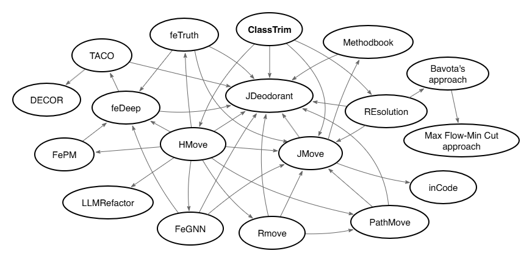

# ClassTrim

ClassTrim is a framework to recommend move method refactoring using Non-dominated Sorting Genetic Algorithm-III (NSGA-III) to minimizing the number of classes that exceed predefined metric thresholds.

## Quick start

1) Prerequisites

- JDK 17+
- Maven 3.8+

2) Configure environment

- Copy `src/main/resources/config.properties.example` to `src/main/resources/config.properties`.
- Edit the new `config.properties` and set values for your environment:
  - `mavenRepo`: absolute path to your local Maven repository
  - `datasetRoot`: absolute path to the datasets root folder
  - `outputFolder`: output folder for results (optional; default `output`)
  - `projectCacheFolder`: folder for serialized project cache (optional; default `.project`)
  - `notifyUrl`: optional webhook for notifications

## Source structure (`src/`)

- `src/main/java`
  - `org.refactor`
    - Entry points: `Main`, `NSGAII`, `NSGAIII`
    - Core optimization: `RefactoringProblem`
  - `org.refactor.baseline`
    - Run and evaluate baselines: `BaselineRefactor`
    - Parsers for baseline outputs: `JDeodorantParser`, `JMoveParser`, `HMoveParser`, `REsolutionParser`, `ParserFactory`
  - `org.refactor.common`
    - Constants: `DatasetEnum`, `BaselineEnum`, `Threshold`, `Metric`, `AlgorithmParameter`
  - `org.refactor.model`
    - Program model: `JavaProject`, `JavaClass`, `JavaMethod`, `JavaObject`
  - `org.refactor.util`
    - Utils: `ASMUtils`, `AppProperties`, `FileUtils`, `MetricUtils`, `RefactorOutput`, `ProjectUtils`, `DebugUtils`, `NotifyUtils`
  - `org.refactor.visitor`
    - Class to parse bytecode: `ClazzVisitor`, `CouplingVisitor`, `MethodInvocationVisitor`
- `src/main/resources`
  - App config template: `config.properties.example`
- `src/test/java`
  - Unit tests for model, metrics, parsers, and baseline application

## Datasets and outputs

- Input datasets are expected under the folder configured via `datasetRoot`.
- Results are written under `outputFolder` (default `output/`). Summaries like `*-summary.tsv` are generated per project-version.

## Baseline comparison (`baseline/`)

This folder contains results from baseline tools for comparison, including:
- Runtime screenshots produced during baseline runs
- Suggested outputs generated by each baseline tool (e.g., `*.tsv` summaries)

Typical subfolders include `JDeodorant/`, `JMove/`, `HMove/` and `REsolution/`, each organized by project-version. These provide reference suggestions and artifacts to compare against this project's NSGA-based refactoring outputs.

## Code features

1. Follow unix philosophy.
2. Uses Lombok to simplify data classes (getters/setters, constructors)
3. Uses Java 8 `Optional` to handle nulls elegantly
4. Emphasizes immutability; returns unmodified collections
5. Caches computed objects to improve performance
6. Keeps dependencies minimal
7. Automatically records experiment results and summaries (summary may be improved by using a database)
8. Includes unit tests

## Rule to compute metrics

Strictly follow the tool [CKjm](https://github.com/dspinellis/ckjm) used in the paper *Shatnawi, R. The application of ROC analysis in threshold identification, data imbalance and metrics selection for software fault prediction. Innovations Syst Softw Eng 13, 201–217 (2017). https://doi.org/10.1007/s11334-017-0295-0*.

Where are the parsed classes and methods possibly from?
1. JDK
2. Third-party libraries
3. Local project

### WMC (Weighted Methods per Class)

Number of methods declared in the class.

### CBO (Coupling Between Objects)

Cardinality of the set of referenced classes (excluding JDK classes), including:
1. Superclass
2. Implemented interfaces
3. Field types
4. Declared method exception types
5. Declared method argument types
6. Declared method return types
7. Other classes referenced via fields
8. Classes of invoked methods

Note: When using global variables from other classes, primitive constants (e.g., `int`, `boolean`) cannot be traced back. See the discussion: https://stackoverflow.com/questions/75954598/how-to-record-visited-constants-by-methodvisitor-in-asm

### RFC (Response For a Class)

Number of methods that can execute in response to a message to the class: sum of the class's own methods and the distinct external methods they directly invoke.
## QA

1. Why are class files visited multiple times?
   - Different traversals collect different facts (e.g., signatures, calls, fields) to compute metrics accurately and cache results.

2. Why not use a database instead of files?
   - The dataset size is modest, and TSV files (not csv file becasue method name may contain comma) plus object serialization keep the footprint and complexity low. A database could improve querying, but is intentionally avoided to reduce operational overhead.

## Thanks

- [ASM](https://asm.ow2.io/)
- [JMetal](https://github.com/jMetal/jMetal)

## License

[MIT](./LICENSE)
