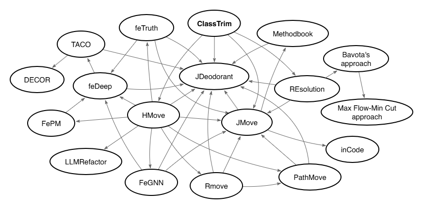

# ClassTrim

ClassTrim is a framework to recommend move method refactoring using Non-dominated Sorting Genetic Algorithm-III (
NSGA-III) to minimizing the number of classes that exceed predefined metric thresholds.

Raw experiment data doi: 10.17632/8b3fd45kp6.1

## Quick start

1) Prerequisites

- JDK 17+
- Maven 3.8+

2) Configure environment

- Copy `classtrim-core/src/main/resources/config.properties.example` to `classtrim-core/src/main/resources/config.properties`.
- Edit the new `config.properties` and set values for your environment:
    - `mavenRepo`: absolute path to your local Maven repository
    - `datasetRoot`: absolute path to the datasets root folder
    - `outputFolder`: output folder for results (optional; default `output`)
    - `projectCacheFolder`: folder for serialized project cache (optional; default `.project`)
    - `notifyUrl`: optional webhook for notifications

3) Entry point
    - `org.classtrim.Main` run the move method refactoring algorithm on each project.
    - `org.classtrim.NSGAII`, `org.classtrim.NSGAIII`, or `org.classtrim.MOEAD` run it once.
    - `org.classtrim.baseline.BaselineRefactor` run baseline comparison experiment.

4) Build and test modules

- Run all modules: `mvn test`
- Run core only: `mvn -pl classtrim-core test`
- Run CLI only: `mvn -pl classtrim-cli test`

5) Build IntelliJ plugin

- Package plugin zip: `mvn -pl classtrim-plugin -am package`
- Output: `classtrim-plugin/target/classtrim-plugin-1.0-SNAPSHOT-idea-plugin.zip`

## Module extraction (in progress)

This repository now includes extraction scaffolding for library-style usage:

- `classtrim-core/`: Maven module packaging the current core code and new injectable APIs under `org.classtrim.core.*`
- `classtrim-cli/`: Maven module with `org.classtrim.cli.RunNsgaiii` example entrypoint using the extracted service API
- `classtrim-plugin/`: IntelliJ IDEA plugin scaffold wired to run core analysis and show notifications

New core API entrypoints:

- `org.classtrim.core.analyzer.ProjectAnalyzer` / `StandardProjectAnalyzer`
- `org.classtrim.core.engine.RefactoringEngine` / `NSGAIIIRefactoringEngine`
- `org.classtrim.core.service.ClassTrimService`
- `org.classtrim.core.model.ProjectSource` / `BinaryPathProjectSource`
- `org.classtrim.core.repository.ProjectRepository` (in-memory and filesystem implementations)

How I calculate metrics and some common question are in [wiki](https://github.com/churchilldu/ClassTrim/wiki).

## Baseline comparison (`baseline/`)

This folder contains results from baseline tools for comparison, including:

- Runtime screenshots produced during baseline runs
- Suggested outputs generated by each baseline tool (e.g., `*.tsv` summaries)

Typical subfolders include `JDeodorant/`, `JMove/`, `HMove/` and `REsolution/`, each organized by project-version. These
provide reference suggestions and artifacts to compare against this project's NSGA-based refactoring outputs.

## Code features

1. Follow unix philosophy.
2. Uses Lombok to simplify data classes (getters/setters, constructors)
3. Uses Java 8 `Optional` to handle nulls elegantly
4. Emphasizes immutability; returns unmodified collections
5. Caches computed objects to improve performance
6. Keeps dependencies minimal
7. Automatically records experiment results and summaries (summary may be improved by using a database)
8. Includes unit tests

## Thanks

- [ASM](https://asm.ow2.io/)
- [JMetal](https://github.com/jMetal/jMetal)

## License

[MIT](./LICENSE)
