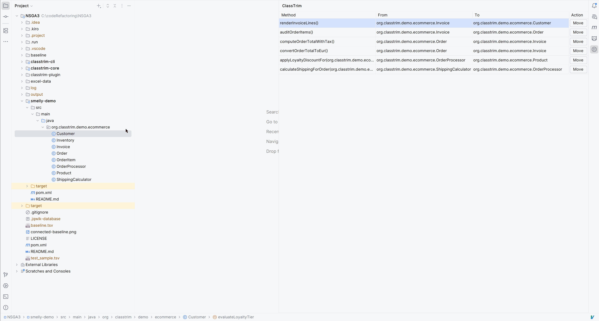

# ClassTrim

ClassTrim is a framework to recommend move method refactoring using Non-dominated Sorting Genetic
Algorithm-II/III (NSGA-II / NSGA-III) to minimize the number of classes that exceed predefined metric
thresholds. After the algorithm produces a Pareto front of candidate refactorings, a single
**knee solution** (the one with the best overall trade-off across objectives) is automatically
selected as the recommended refactoring.

Raw experiment data doi: 10.17632/8b3fd45kp6.1

## Demo

Run ClassTrim plugin on smelly-demo

## Quick start

1) Prerequisites

- JDK 17+
- Maven 3.8+

2) Configure environment

- Copy `classtrim-core/src/main/resources/config.properties.example` to `classtrim-core/src/main/resources/config.properties`.
- Edit the new `config.properties` and set values for your environment:
    - `mavenRepo`: absolute path to your local Maven repository
    - `datasetRoot`: absolute path to the datasets root folder
    - `outputFolder`: output folder for results (optional; default `output`)
    - `projectCacheFolder`: folder for serialized project cache (optional; default `.project`)
    - `notifyUrl`: optional webhook for notifications

3) Entry point
    - `org.classtrim.Main` run the move method refactoring algorithm on each project.
    - `org.classtrim.NSGAII`, `org.classtrim.NSGAIII`, or `org.classtrim.MOEAD` run it once.
    - `org.classtrim.baseline.BaselineRefactor` run baseline comparison experiment.

4) Build and test modules

- Run all modules: `mvn test`
- Run core only: `mvn -pl classtrim-core test`
- Run CLI only: `mvn -pl classtrim-cli test`

5) Build IntelliJ plugin

- Package plugin zip: `mvn -pl classtrim-plugin -am package`
- Output: `classtrim-plugin/target/classtrim-plugin-1.0-SNAPSHOT-idea-plugin.zip`

## Module extraction (in progress)

This repository now includes extraction scaffolding for library-style usage:

- `classtrim-core/`: Maven module packaging the current core code and new injectable APIs under `org.classtrim.core.*`
- `classtrim-cli/`: Maven module with `org.classtrim.cli.RunNsgaiii` example entrypoint using the extracted service API
- `classtrim-plugin/`: IntelliJ IDEA plugin scaffold wired to run core analysis and show notifications

New core API entrypoints:

- `org.classtrim.core.analyzer.ProjectAnalyzer` / `StandardProjectAnalyzer`
- `org.classtrim.core.engine.RefactoringEngine` / `NSGAIIIRefactoringEngine`
- `org.classtrim.core.service.ClassTrimService`
- `org.classtrim.core.model.ProjectSource` / `BinaryPathProjectSource`
- `org.classtrim.core.repository.ProjectRepository` (in-memory and filesystem implementations)

How I calculate metrics and some common question are in [wiki](https://github.com/churchilldu/ClassTrim/wiki).

## Baseline comparison (`baseline/`)

This folder contains results from baseline tools for comparison, including:

- Runtime screenshots produced during baseline runs
- Suggested outputs generated by each baseline tool (e.g., `*.tsv` summaries)

Typical subfolders include `JDeodorant/`, `JMove/`, `HMove/` and `REsolution/`, each organized by project-version. These
provide reference suggestions and artifacts to compare against this project's NSGA-based refactoring outputs.

## Code features

1. Follow unix philosophy.
2. Uses Lombok to simplify data classes (getters/setters, constructors)
3. Uses Java 8 `Optional` to handle nulls elegantly
4. Emphasizes immutability; returns unmodified collections
5. Caches computed objects to improve performance
6. Keeps dependencies minimal
7. Automatically records experiment results and summaries (summary may be improved by using a database)
8. Includes unit tests

## Knee-point selection

NSGA only outputs a set of non-dominated (Pareto) solutions; ClassTrim's `RefactorOutput` then
selects the **knee** of that front as the single recommended refactoring, following

> Das, I., *"On characterizing the 'knee' of the Pareto curve based on Normal-Boundary
> Intersection"*, Structural Optimization 18, 107–115 (1999). doi:10.1007/BF01195985

**How the knee is chosen** (`org.classtrim.core.util.KneeSelection`):

1. Compute the **ideal (utopian) point** — the per-objective minimum across the front.
2. Find the **anchor** solutions — the front member minimizing each objective alone (the pay-off rows).
3. Build the **CHIM** hyperplane (Convex Hull of Individual Minima) through the anchors.
4. Pick the front point of **maximum bulge** — farthest from the CHIM on the side of the ideal
   point. This is the point where each objective trade-off is most balanced. The construction is
   invariant to (global) rescaling of the objectives and generalizes to any number of objectives.

Selection uses **only the 3 real objectives (WMC, CBO, RFC)**; the NSGA-III guiding objectives are
search heuristics and are intentionally excluded. Degenerate fronts whose anchors collapse to a
point fall back to choosing the solution closest to the ideal point.

**Output:** the knee is placed first, so `diff-01` / `metrics-01` are the recommended refactoring, and
an explicit `KNEE.csv` marks its objective values. The full front is still preserved in
`FUN.csv` / `VAR.csv`.

Unit tests: `KneeSelectionTest`

## Human evaluation

The quality of ClassTrim's Move-Method suggestions is assessed through a **blinded expert
questionnaire** (full plan in `human-evaluation-plan.md`, results in `human-eval/` and
`human-eval/report.md`). Executive summary:

- **5 tools compared** — ours (ClassTrim) vs HMove, JDeodorant, JMove, REsolution.
- **100 suggestions** (20 per tool) sampled with a fixed seed; ClassTrim is deliberately sampled at an
  *average* level (standout feature-envy cases excluded) to avoid cherry-picking.
- **Blinding:** suggestions are shuffled into neutral IDs `S001`–`S100`; reviewers never see the tool,
  metrics, or internal bookkeeping.
- **20 expert reviewers** (senior Java developer personas) judge items on a fixed questionnaire
  (RQ1-Q5): acceptance, usefulness (1-5), diagnostic value (worth inspecting?), rejection reasons,
  and free-text comments.
- **Each item is reviewed by exactly 2 experts** (balanced 20x10 assignment) to measure inter-rater
  agreement / Cohen's kappa.
- **Analysis:** acceptance rates and Q2/Q3 means per tool, ClassTrim-vs-baseline deltas, the
  "detects what not where" hypothesis (Q3 vs Q1), and cross-checks vs `output/baseline-overlap.md`.

## Thanks

- [ASM](https://asm.ow2.io/)
- [JMetal](https://github.com/jMetal/jMetal)

## License

[MIT](./LICENSE)
